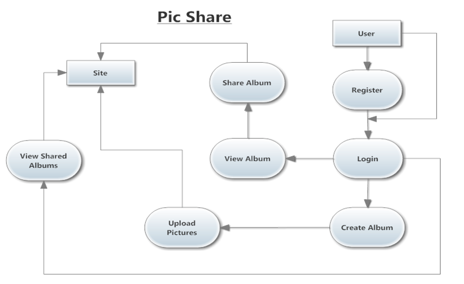
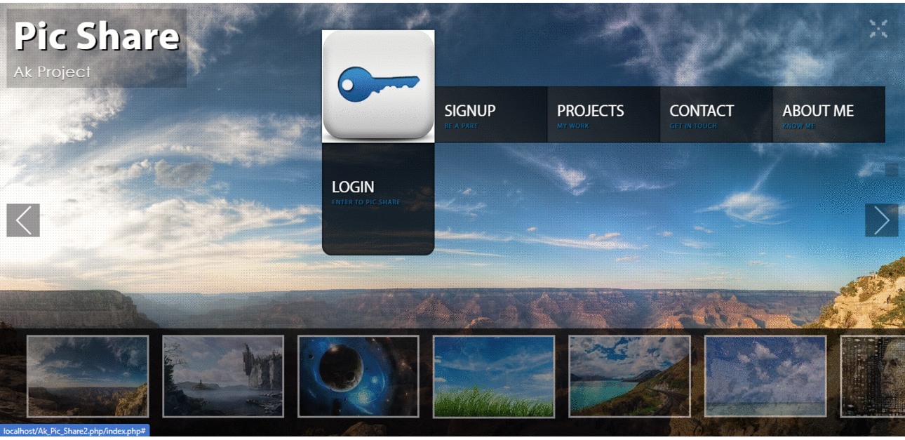

# PicShare_PHP_WebSite 

Picshare is a online picture slideshow maker that lets you create professional looking picture sideshows in no time. All you have to do is upload images, customize them using provided templates and then share with others. With Picshare it's easier than ever to add photos, create elegant photo slideshows and share them with your friends and family. It has stylish customizable templates.

 
 
 
 
 
 

### Problem Statement
> If you have plenty of good photographs with you giving the insight into your life’s journey with your family and friends or just a peep into your love for photography. 
> But when it comes to compiling some of them in a form of a Slideshow, you often tend to get short of options and your mood gets off.
> Well, this will no longer be an issue with Picshare – a web based application that enables you to create professional, good quality photo slideshows.

> The procedure to use this application is really simple involving three simple steps:-
1. upload your photos 
2. Choose a template from the dozens of options 
3. Make and publish your slideshow 

### Difference from other available site
1. It provides security of images through taking Print Screen as prntscr key and other keys are disabled.
2. For direct download safety, right click of mouse are disabled.
3. Comments can be read by selected viewers assigned by up-loader.
4. Can be available with offline chat also.
5. Forgotten password directly send to your respective registered     E-mail without any further questioning.

#### WebSite Glimpse

